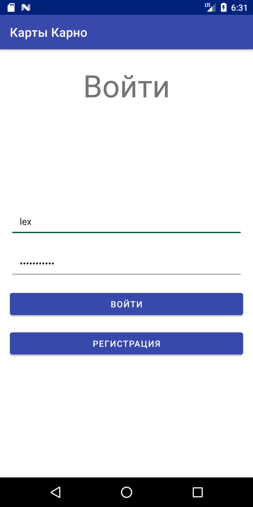
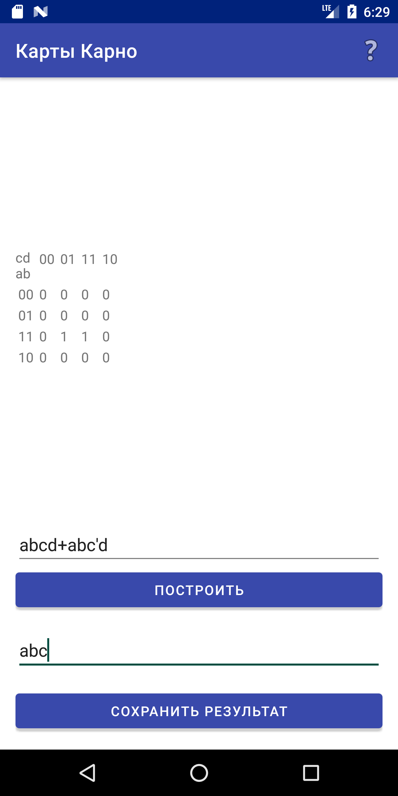
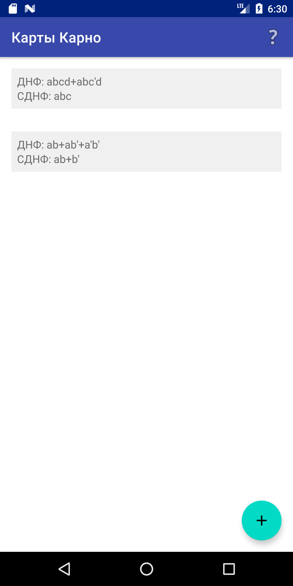
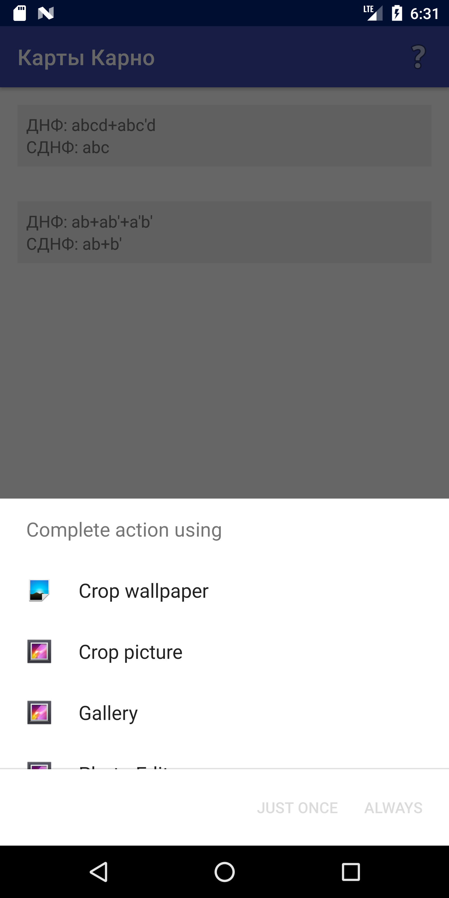

# Карты Карно

Карты Карно - Android приложение для построения таблицы истинности в виде карты Карно.

## Скриншоты

## Содержание
Данное приложение содержит следующие фрагменты:

1. Авторизация

2. Регистрация

3. Список выражений

4. Редактор карты

5. Раздел "Помощь"

В разделах "авторизация" и "регистрация" реализована простая система авторизации пользователей.

В разделе редактора карт имеется возможность на основании логического выражения сгенерировать карту Карно, ввести сокращённое логическое выражение и сохранить карту в файл, а выражение в базу данных.

В разделе списка пользователю предоставляется возможность выбрать ранее сохранённое изображение и открыть изображение карты в любом приложении для просмотра изображений.